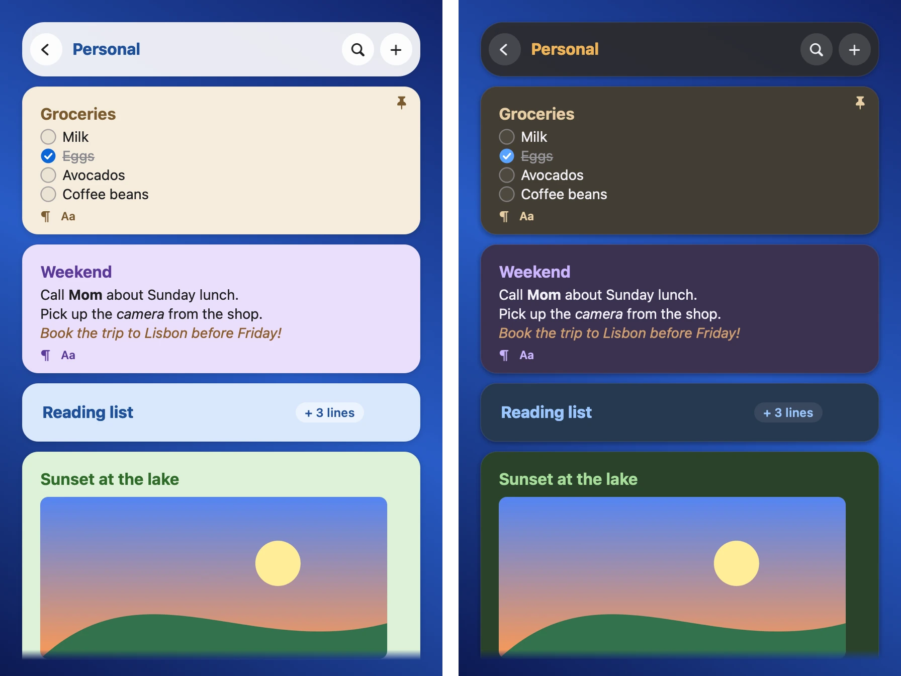
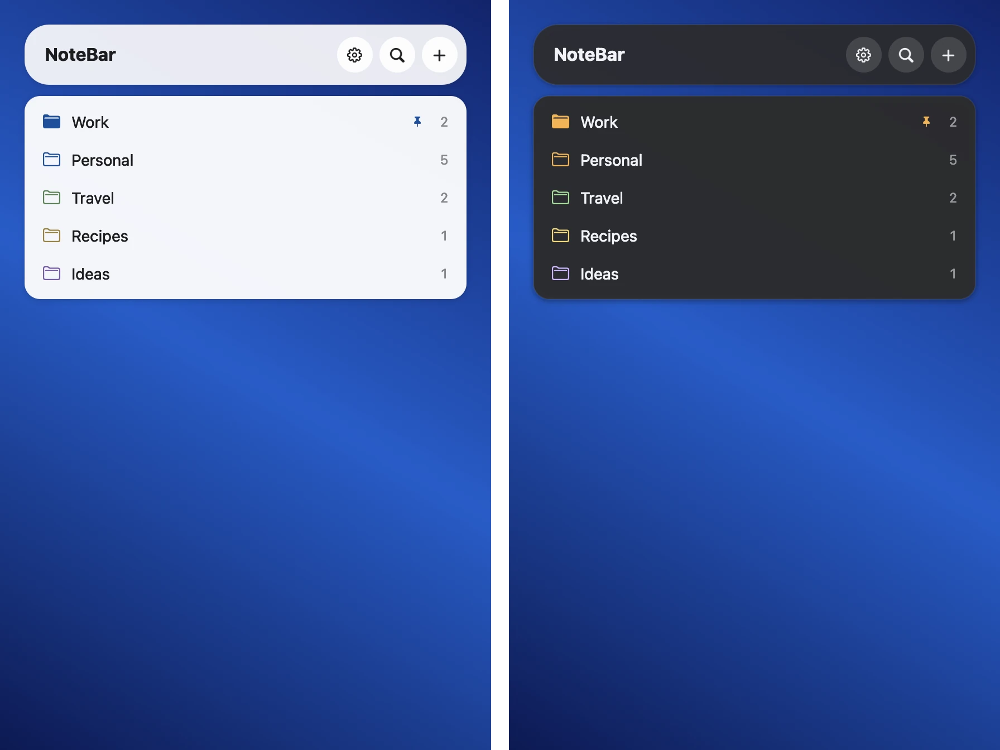
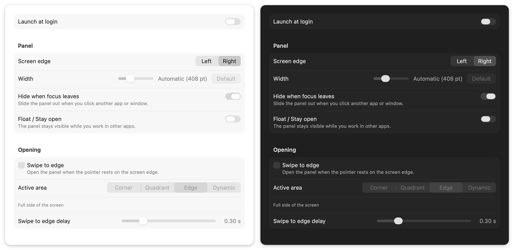

# NoteBar

**NoteBar keeps your notes one keystroke away.** A notes panel slides in from the side of your screen,
above all your apps, including full-screen apps. Write a note, check off a list, then push Esc and
continue your work.



## What you can do

- **Open it from anywhere.** Push ⌥⌘N, click the menu bar icon, or move the pointer to the edge of
  the screen.
- **Write fast.** The first line of a note is its title. Bold, italic, lists and checklists show as
  you type. You do not see the Markdown marks.
- **Add pictures and files.** Paste them, or drop them on the panel.
- **Keep things in order.** Put notes in folders, give them colors, pin the important ones, and fold
  long notes.
- **Find anything.** Search one folder or all of them.
- **Make it yours.** Light and dark mode, themes, and Liquid Glass cards.
- **Keep your data private.** Your notes stay on your Mac, with automatic backups. NoteBar has no
  account, no cloud and no sync.




## Install

NoteBar needs a Mac with Apple silicon and macOS 26 or later. There is no prebuilt download yet, so
you build it from source. You only need the Xcode Command Line Tools (`xcode-select --install`):

```bash
git clone https://github.com/aureleon/notebar.git
cd notebar
scripts/build-app.sh
```

The script installs NoteBar in `~/Applications`. Open it, and its icon shows in the menu bar. For
more about the build, see [Development](docs/DEVELOPMENT.md).

## First steps

| To do this | Do this |
|---|---|
| Show or hide the panel | Push ⌥⌘N, or click the menu bar icon |
| Make a new note | Click `+`, or push ⌘N |
| Search | Push ⌘F |
| Close the panel | Push Esc |
| Change the settings | Push ⌘, |

To open the panel when the pointer touches the edge of the screen, turn on
Settings › General › Swipe to edge.



## Learn more

- [User guide](docs/GUIDE.md): all the features, the keyboard shortcuts, the archive, undo, and
  vim keys.
- [Keybindings](docs/KEYBINDINGS.md): a full list of the keys.
- [Automation](docs/AUTOMATION.md): links (`notebar://`), AppleScript, and the Services menu.
- [Development](docs/DEVELOPMENT.md): build, project layout, tests, and how to make the pictures
  again.
