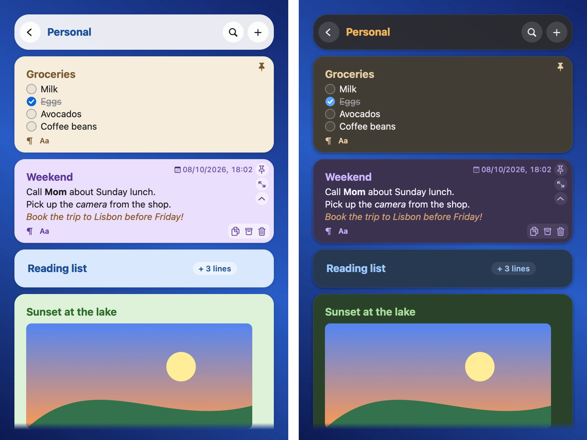
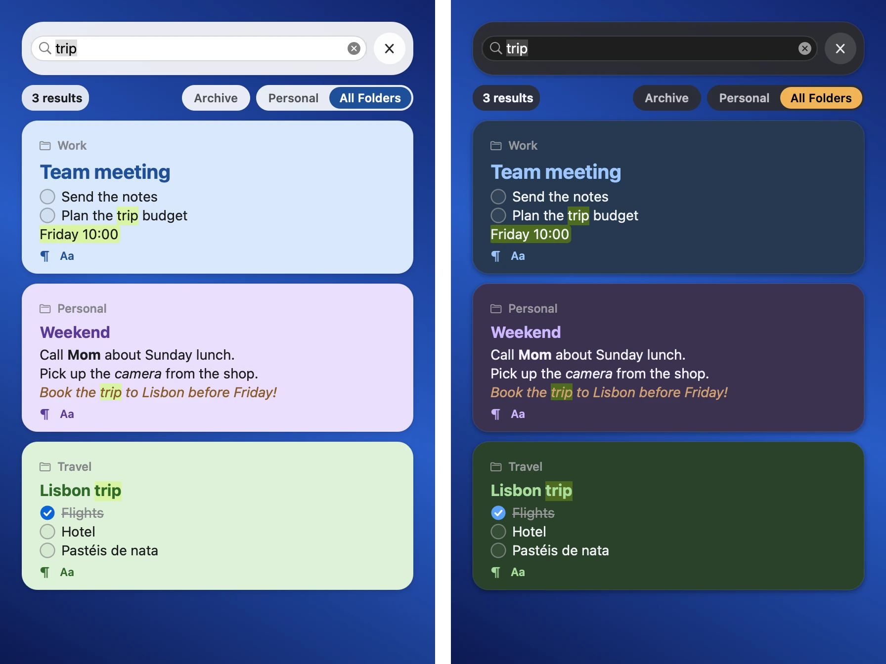
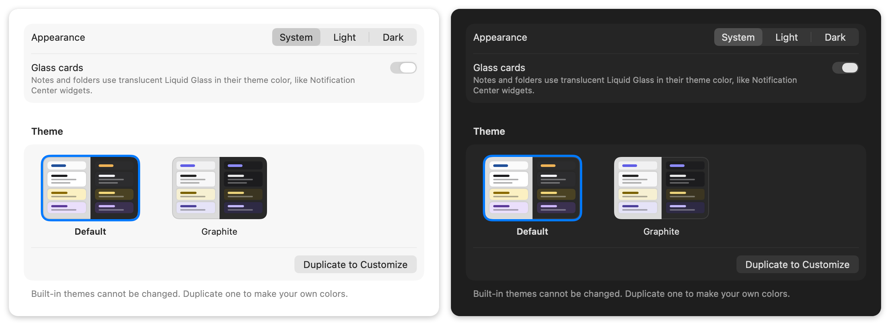

# NoteBar user guide

This guide tells you about all the features of NoteBar. For a short introduction, see the
[README](../README.md).

## Open the panel

- Push ⌥⌘N (Option-Command-N). You can change this key in Settings › Shortcuts.
- Click the NoteBar icon in the menu bar.
- Swipe to edge: move the pointer to the edge of the screen. This is off by default. To turn it on,
  go to Settings › General › Swipe to edge. You can select the part of the edge that opens the panel:
  - **Corner**: the top 120 points of the edge.
  - **Quadrant**: the upper half of the edge.
  - **Edge**: all of the edge, except the menu bar and the bottom corner.
  - **Dynamic**: the part of the edge next to the notes that show in the panel.
- Use a link or a script. See [Automation](AUTOMATION.md).

When you open the panel with swipe to edge or when you drag a file to the edge, NoteBar does not
take the keyboard from the app you use. The panel closes again when the pointer goes away from it.
Click the panel to type in it.

To move the panel to the left or the right side of the screen, use the menu bar icon or
Settings › General.

## Keyboard shortcuts

| Action | How |
|---|---|
| Show or hide the panel | ⌥⌘N, the menu bar icon, or swipe to edge (if it is on) |
| New note | `+`, ⌘N, or ⌃⌥⌘N from any app |
| New note from the clipboard | ⌃⌥⌘V from any app |
| Search | ⌘F (⌘/ searches all folders), or ⌃⌥⌘F from any app |
| Go through the search results | Tab and ⇧Tab (from the search field, through the results, back to the field) |
| Leave a note, then hide the panel | Esc |
| Go back to the folder list | ⌘[ or the back button |
| Fold or unfold a note | ⌥⌘← and ⌥⌘→ (also while you type), or the fold button |
| Archive or unarchive a note | ⌥⌘A (also while you type), or the archive button on the card |
| Move a note to a different folder | ⌘⇧M |
| Settings | ⌘, |

You can change the shortcuts that work from any app in Settings › Shortcuts. For a list of all keys,
see [Keybindings](KEYBINDINGS.md).

## Notes

- The first line of a note is its title.
- Each note has a mode:
  - **Standard**: Markdown. The editor hides the Markdown marks and shows the styles (bold, italic,
    code, highlight, headings, quotes, lists and checklists). To see the marks, turn off
    Settings › Appearance › Hide Markdown markup.
  - **Plain Text**: no styles.
  - **Code**: a monospaced font.
- To add a picture or a file, paste it, or drop it on the panel or on a card. A file shows as a tile
  with a preview.
- Text such as `#ff8800` shows a small sample of the color.

## The controls on a card

When the pointer is on a card, the card shows these controls:

- In the top-right corner: the date and the pin button. Below the pin are the expand and fold
  buttons. A pinned note always shows its pin. An expanded note always shows its collapse button.
- In the bottom-right corner: copy the text, archive, and delete.
- A folded note shows a `+ N lines` button. Click it to unfold the note.

The bottom-left corner of an unfolded card always shows two buttons:

- `Aa` opens the formatting menu. Only Standard notes have it.
- The Color & Mode button sets the color and the mode of the note. Its icon shows the mode: ¶ for
  Standard, `{ }` for Code, and ≡ for Plain. On Code and Plain notes, it takes the place of `Aa`.

## Folders

- Folders hold your notes. You can give a folder a color, and pin it to the top of the list.
- Drag notes and folders to change their order.
- Search finds notes in the open folder. Click **All Folders** above the results to search all
  folders.

## Undo and deleted items

- ⌘Z and ⇧⌘Z undo and redo note and folder actions: color, mode, fold, pin, order, move, rename,
  new note, new folder and delete. While you type in a note, ⌘Z undoes the text only.
- Before NoteBar deletes an item, it asks you. This is true for keys, for the trash button on a card,
  and for menus. A deleted note or folder goes to the trash. To get it back, click Undo on the
  message, or push ⌘Z.
- Settings › Data › Keep deleted items sets how long deleted items stay: until NoteBar quits, for
  1 hour (the default), or for 30 days. Until then, you can find them in **Recently Deleted**, a row
  at the end of the folder list. Click it to restore an item, to delete it now, or to empty the list.
  Delete Now also asks you first.

## Archive

- To move a note to the archive, push ⌥⌘A or click the archive button. To get it back, click Undo
  on the message, or push ⌘Z.
- The **Archive** row at the end of the folder list shows the archived notes of all folders. The
  most recently archived note is first. Each card shows its folder. To put a note back in its folder,
  at its old position, push ⌥⌘A or click the button again.
- Search does not show archived notes. To find them too, turn on the **Archive** chip above the
  results. A search in the Archive finds only archived notes.
- You cannot move an archived note to a different folder. Unarchive it first.

## Look

- NoteBar has light and dark mode, and themes. You can make your own theme in Settings › Appearance.
- Cards use Liquid Glass. To use solid cards, turn off Settings › Appearance › Glass cards.
- A note color can fill the card, or show as a bar on the left side of the card.

## Vim keys

Vim keys are off by default. To turn them on, go to Settings › Shortcuts › Use Vim keys.

- A note opens in Normal mode, with a block cursor. A new, empty note opens in Insert mode.
- These standard vim keys work: motions, counts, operators (`d` `c` `y`), `p` `P` `u` `⌃R` `r` `.`,
  Visual mode (`v` `V`), search (`/` `?` `n` `N`) and `:` commands.
- ⌃W J and ⌃W K edit the next and the previous note. A folded note unfolds.
- On a selected note that you do not edit, `gp` `gc` `gm` `gy` `ge` `ga` `gx` `dd` `za` `zc` `zo`
  also work. `gg` and `G` select the first and the last note.

NoteBar adds these keys:

| Action | Keys |
|---|---|
| Pin the note | `gp`, `:pin` |
| Fold the note | `za` `zc` `zo`, `:fold`, `:unfold` |
| Color and mode | `gc`, `:color [name]`, `:mode [standard\|code\|plain]` |
| Move to a folder | `gm`, `:move [folder]` |
| Copy the note | `gy`, `:copy` |
| Expand or collapse the card | `ge` (like ⇧⌘E) |
| Formatting menu | `gf` |
| Archive or unarchive the note | `ga`, `:archive`, `:unarchive` |
| Delete the note (with the usual alert, undoable) | `gx`, `:delete` (`dd` on a selected note) |
| Stop editing | `:q` |
| Go up to the folder list | ⌃[ (in Insert mode, ⌃[ is Esc) |
| Folder list | `j` `k` select, `gg` `G` first and last, `l` or Return opens, `o` new folder |
| Selected folder | `R` or `cw` rename, `gp` pin, `gc` color, `gx` or `dd` delete (with the usual alert) |

## Your data

NoteBar keeps your notes on your Mac only, in `~/Library/Application Support/NoteBar`:

- `notebar.sqlite`: the database with your notes
- `attachments/`: your pictures and files
- `Backups/`: automatic backups

You can make a backup, restore a backup, and export all notes as Markdown files in Settings › Data.
